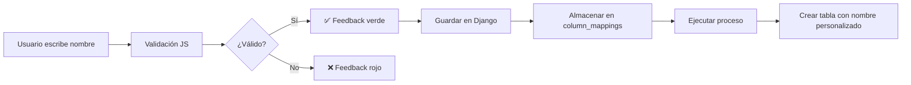

# 📋 Guía de Uso: Renombrado de Hojas de Excel

## 🎯 Descripción General

Esta funcionalidad permite **personalizar los nombres de las tablas SQL Server** que se crean a partir de cada hoja de Excel procesada. Los nombres personalizados deben cumplir con las convenciones de SQL Server.

---

## 🚀 Cómo Usar

### 1️⃣ Acceder a la Vista Multi-Configuración

```
http://localhost:8000/automatizacion/excel/<id>/multi-config/
```

Donde `<id>` es el ID del proceso Excel que deseas configurar.

### 2️⃣ Renombrar Hojas

En la sección **"📝 Renombrar Hojas"**, verás un input editable para cada hoja del Excel:

```
Hoja Original: Ventas Enero 2024
┌──────────────────────────────────┐
│ ventas_enero_2024                │  ✅ Nombre válido: ventas_enero_2024
└──────────────────────────────────┘
```

#### Validaciones en Tiempo Real:

| Estado | Icono | Color | Significado |
|--------|-------|-------|-------------|
| **Válido** | ✅ | Verde | Nombre cumple todas las reglas |
| **Advertencia** | ⚠️ | Amarillo | Se aplicará normalización automática |
| **Error** | ❌ | Rojo | Nombre duplicado (bloquea guardado) |

### 3️⃣ Reglas de Nombrado

✅ **Permitido:**
- Letras minúsculas: `a-z`
- Números: `0-9`
- Guiones bajos: `_`

❌ **No permitido:**
- Espacios: `Ventas Enero` → `ventas_enero`
- Mayúsculas: `Ventas` → `ventas`
- Acentos: `año` → `ano`
- Caracteres especiales: `#, $, %, &, -, .`

### 4️⃣ Normalización Automática

El sistema **sugiere nombres válidos** automáticamente:

| Nombre Original | Normalización Sugerida |
|-----------------|------------------------|
| `Ventas Enero 2024` | `ventas_enero_2024` |
| `Clientes - México` | `clientes_mexico` |
| `Año Fiscal 2023` | `ano_fiscal_2023` |
| `Sheet1` | `sheet1` |

Si escribes un nombre con mayúsculas o espacios, verás:

```
⚠️ Se normalizará a: ventas_enero_2024
```

### 5️⃣ Prevención de Duplicados

Si intentas usar el mismo nombre dos veces, verás:

```
❌ Nombre duplicado: 'ventas' ya existe
```

El botón **Guardar Configuración** se deshabilitará hasta corregir el error.

### 6️⃣ Guardar y Ejecutar

1. **Guardar Configuración**: Almacena los nombres personalizados
2. **Ejecutar Proceso**: Crea las tablas con los nuevos nombres

---

## 🗄️ Resultado en SQL Server

### Antes del Renombrado:
```sql
ProcessName_Ventas Enero 2024  -- ❌ Nombre con espacios (problemático)
ProcessName_Sheet1             -- ❌ Nombre genérico (poco descriptivo)
```

### Después del Renombrado:
```sql
ProcessName_ventas_enero_2024  -- ✅ Nombre limpio y descriptivo
ProcessName_clientes_activos   -- ✅ Nombre semántico
```

---

## 🔧 Estructura Técnica

### Almacenamiento en Base de Datos

Los nombres personalizados se guardan en el campo `column_mappings` del modelo `MigrationProcess`:

```json
{
  "__sheet_names__": {
    "Ventas Enero 2024": "ventas_enero_2024",
    "Clientes - México": "clientes_mexico",
    "Sheet1": "resumen_anual"
  },
  "ventas_enero_2024": {
    "Fecha de Venta": "fecha_venta",
    "Monto Total": "monto_total"
  }
}
```

**Clave especial:** `__sheet_names__`  
**Formato:** `{ "nombre_original": "nombre_personalizado" }`

### Flujo de Datos



### Código JavaScript (Validación)

```javascript
function normalizeSheetName(name) {
    // 1. Eliminar acentos (NFD + regex)
    let normalized = name.normalize('NFD').replace(/[\u0300-\u036f]/g, '');
    
    // 2. Convertir a minúsculas
    normalized = normalized.toLowerCase();
    
    // 3. Reemplazar espacios y guiones por _
    normalized = normalized.replace(/[\s\-]+/g, '_');
    
    // 4. Remover caracteres especiales
    normalized = normalized.replace(/[^a-z0-9_]/g, '');
    
    // 5. Remover múltiples guiones bajos consecutivos
    normalized = normalized.replace(/_+/g, '_');
    
    // 6. Remover guiones bajos al inicio/final
    normalized = normalized.replace(/^_+|_+$/g, '');
    
    return normalized;
}
```

### Código Python (Backend)

#### views.py - Validación y Almacenamiento
```python
# Extraer sheet_mappings del POST
sheet_mappings = data.get('sheet_mappings', {})

if sheet_mappings:
    # Validar cada nombre personalizado
    for original_name, custom_name in sheet_mappings.items():
        if not re.match(r'^[a-z0-9_]+$', custom_name):
            return JsonResponse({
                'success': False,
                'message': f'Nombre de hoja inválido: {custom_name}'
            })
    
    # Guardar en column_mappings con clave especial
    if 'column_mappings' not in process.column_mappings:
        process.column_mappings = {}
    process.column_mappings['__sheet_names__'] = sheet_mappings
```

#### models.py - Aplicación en Flujo de Carga
```python
def _process_excel_sheets_individually(self, df_dict):
    # Obtener mapeos de hojas personalizados
    sheet_mappings = self.column_mappings.get('__sheet_names__', {})
    
    for sheet_name, df in df_dict.items():
        # Usar nombre personalizado si existe
        if sheet_name in sheet_mappings:
            custom_sheet_name = sheet_mappings[sheet_name]
            logger.info(f"Usando nombre personalizado para hoja '{sheet_name}' → '{custom_sheet_name}'")
            table_name_part = custom_sheet_name
        else:
            table_name_part = sheet_name
        
        # Crear tabla con nombre personalizado
        nombre_tabla_destino = f"{self.name}_{table_name_part}"
        logger.info(f"Nombre final de tabla: {nombre_tabla_destino}")
```

---

## ✅ Casos de Uso

### Caso 1: Excel con Hojas Genéricas

**Antes:**
- `Sheet1` → `ProcessName_Sheet1`
- `Sheet2` → `ProcessName_Sheet2`

**Después:**
- `Sheet1` → `ventas_2024` → `ProcessName_ventas_2024`
- `Sheet2` → `clientes_activos` → `ProcessName_clientes_activos`

### Caso 2: Excel con Nombres Problemáticos

**Antes:**
- `Ventas - México 2024` → `ProcessName_Ventas - México 2024` ❌ (espacios, guiones, acentos)
- `Año Fiscal` → `ProcessName_Año Fiscal` ❌ (espacios, acentos)

**Después:**
- `Ventas - México 2024` → `ventas_mexico_2024` → `ProcessName_ventas_mexico_2024` ✅
- `Año Fiscal` → `ano_fiscal` → `ProcessName_ano_fiscal` ✅

---

## 🐛 Solución de Problemas

### Problema: No puedo guardar la configuración

**Causa:** Hay nombres duplicados o inválidos

**Solución:**
1. Busca inputs con borde rojo (❌)
2. Lee el mensaje de error: "Nombre duplicado: 'X' ya existe"
3. Cambia uno de los nombres duplicados

---

### Problema: La validación no se activa

**Causa:** JavaScript no se está ejecutando

**Solución:**
1. Abre la consola del navegador (F12)
2. Busca errores en rojo
3. Recarga la página (Ctrl + Shift + R)
4. Verifica que el template tenga las funciones JS:
   - `normalizeSheetName()`
   - `validateSheetName()`
   - `updateSaveButtonState()`

---

### Problema: Los nombres personalizados no se aplican en SQL Server

**Causa 1:** Los nombres no se guardaron correctamente

**Verificación:**
```python
from automatizacion.models import MigrationProcess
process = MigrationProcess.objects.get(id=<ID>)
print(process.column_mappings.get('__sheet_names__'))
```

**Esperado:** `{'Sheet1': 'ventas', 'Sheet2': 'clientes'}`

**Causa 2:** El proceso se ejecutó antes de guardar los nombres

**Solución:**
1. Ve a la vista multi-config
2. Verifica que los nombres estén en los inputs
3. Haz clic en **"Guardar Configuración"**
4. Luego haz clic en **"Ejecutar Proceso"**

---

## 📊 Verificación en SQL Server

### Consultar Tablas Creadas

```sql
-- Ver todas las tablas del proceso
SELECT name 
FROM sys.tables 
WHERE name LIKE 'ProcessName_%'
ORDER BY create_date DESC;
```

### Consultar Columnas de una Tabla

```sql
-- Ver estructura de tabla con nombre personalizado
SELECT COLUMN_NAME, DATA_TYPE, CHARACTER_MAXIMUM_LENGTH
FROM INFORMATION_SCHEMA.COLUMNS
WHERE TABLE_NAME = 'ProcessName_ventas_enero_2024'
ORDER BY ORDINAL_POSITION;
```

---

## 🎓 Consejos de Buenas Prácticas

### ✅ Recomendaciones:

1. **Nombres Descriptivos:**
   - ❌ `sheet1`, `hoja2`
   - ✅ `ventas_enero`, `clientes_activos`

2. **Convención Consistente:**
   - Usa siempre `snake_case` (minúsculas con guiones bajos)
   - Ejemplo: `ventas_region_norte_2024`

3. **Nombres Cortos pero Claros:**
   - ❌ `informacion_completa_de_ventas_mensuales_del_primer_trimestre`
   - ✅ `ventas_q1_2024`

4. **Incluir Contexto Temporal:**
   - ✅ `ventas_2024`
   - ✅ `clientes_enero`
   - ✅ `inventario_q1`

### ❌ Evitar:

1. **Nombres Ambiguos:**
   - ❌ `datos`, `info`, `tabla1`

2. **Abreviaturas Crípticas:**
   - ❌ `vnt_mex_24_q1_reg_nrt`
   - ✅ `ventas_mexico_q1_2024`

3. **Palabras Reservadas SQL:**
   - ❌ `select`, `table`, `order`, `user`

---

## 🔄 Integración con Renombrado de Columnas

Los renombrados de hojas y columnas funcionan **de manera independiente**:

```json
{
  "__sheet_names__": {
    "Ventas 2024": "ventas_2024"
  },
  "ventas_2024": {
    "Fecha de Venta": "fecha_venta",
    "Monto Total": "monto_total"
  }
}
```

**Flujo:**
1. Renombrar hoja: `"Ventas 2024"` → `"ventas_2024"`
2. Renombrar columnas dentro de `"ventas_2024"`:
   - `"Fecha de Venta"` → `"fecha_venta"`
   - `"Monto Total"` → `"monto_total"`

**Resultado en SQL Server:**
```sql
CREATE TABLE ProcessName_ventas_2024 (
    fecha_venta DATE,
    monto_total DECIMAL(18,2)
);
```

---

## 📝 Ejemplo Completo Paso a Paso

### Paso 1: Crear Proceso Excel

```python
# En Django Admin o vista de creación
Nombre: ReporteVentas
Archivo Excel: ventas_2024.xlsx
```

### Paso 2: Navegar a Multi-Config

```
http://localhost:8000/automatizacion/excel/5/multi-config/
```

### Paso 3: Seleccionar Hojas

```
☑ Ventas Enero
☑ Ventas Febrero
☑ Clientes Nuevos
```

### Paso 4: Renombrar Hojas

| Original | Personalizado | Estado |
|----------|---------------|--------|
| Ventas Enero | `ventas_enero` | ✅ |
| Ventas Febrero | `ventas_febrero` | ✅ |
| Clientes Nuevos | `clientes_nuevos` | ✅ |

### Paso 5: Configurar Columnas (opcional)

Para la hoja `ventas_enero`:

| Columna Original | Renombrado | Tipo |
|------------------|------------|------|
| Fecha de Venta | `fecha_venta` | DATE |
| Monto Total | `monto_total` | DECIMAL |
| Cliente | `cliente_nombre` | VARCHAR |

### Paso 6: Guardar Configuración

```
✅ Configuración guardada exitosamente
```

### Paso 7: Ejecutar Proceso

```
✅ Proceso ejecutado correctamente
   - Tabla creada: ReporteVentas_ventas_enero
   - Tabla creada: ReporteVentas_ventas_febrero
   - Tabla creada: ReporteVentas_clientes_nuevos
```

### Paso 8: Verificar en SQL Server

```sql
SELECT name 
FROM sys.tables 
WHERE name LIKE 'ReporteVentas_%';
```

**Resultado:**
```
ReporteVentas_ventas_enero
ReporteVentas_ventas_febrero
ReporteVentas_clientes_nuevos
```

---

## 🔍 Preguntas Frecuentes (FAQ)

### ¿Puedo dejar un nombre en blanco?

**Sí.** Si dejas el input vacío, se usará el nombre original normalizado automáticamente.

**Ejemplo:**
- Original: `Ventas Enero 2024`
- Input: `[vacío]`
- Resultado: `ventas_enero_2024` (normalización automática)

---

### ¿Qué pasa si cambio el nombre de una hoja después de ejecutar el proceso?

**Comportamiento:**
1. La **tabla antigua permanece** en SQL Server
2. La próxima ejecución creará una **nueva tabla** con el nuevo nombre
3. Los datos no se migran automáticamente

**Recomendación:**
- Usa scripts SQL para renombrar tablas si es necesario:
  ```sql
  EXEC sp_rename 'ProcessName_old_name', 'ProcessName_new_name';
  ```

---

### ¿Los nombres son case-sensitive en SQL Server?

**Depende de la collation del servidor:**
- **SQL_Latin1_General_CP1_CI_AS:** Case-Insensitive ✅ (`ventas` = `VENTAS`)
- **Latin1_General_CS_AS:** Case-Sensitive ❌ (`ventas` ≠ `VENTAS`)

**Recomendación:** Usa siempre **minúsculas** para evitar problemas.

---

### ¿Puedo usar números al inicio del nombre?

**Sí**, pero **no es recomendable** para tablas SQL:

❌ **Evitar:**
- `2024_ventas` (comienza con número)

✅ **Preferir:**
- `ventas_2024` (comienza con letra)

**Razón:** Algunos sistemas requieren escapar nombres que comienzan con números:
```sql
SELECT * FROM [2024_ventas];  -- Requiere corchetes
SELECT * FROM ventas_2024;    -- No requiere escapado
```

---

## 🎉 Conclusión

Esta funcionalidad te permite:

✅ **Controlar** los nombres de las tablas SQL generadas  
✅ **Estandarizar** nomenclaturas en toda tu organización  
✅ **Evitar** nombres problemáticos con espacios o caracteres especiales  
✅ **Mejorar** la mantenibilidad de tu base de datos  

**¡Usa nombres descriptivos y consistentes para facilitar el análisis de datos! 📊**
