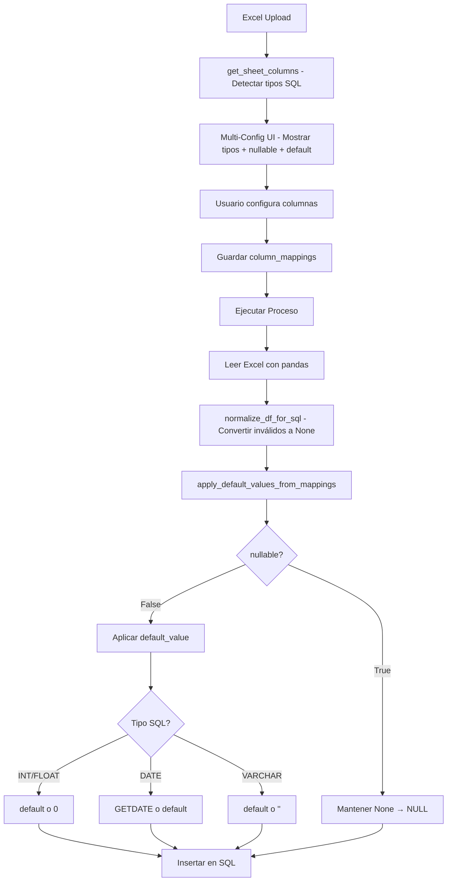

# 🔧 Mejora: Normalización de Valores Vacíos Según Tipo SQL

## 📋 Estado Actual del Sistema

### ✅ **Lo que YA funciona:**

1. **Detección automática de tipos SQL** (`utils.py` → `get_sheet_columns()`)
   - ✅ Detecta `int64, int32` → `INT`
   - ✅ Detecta `float64, float32` → `FLOAT`
   - ✅ Detecta `datetime64` → `DATE/DATETIME`
   - ✅ Detecta `object` → `NVARCHAR(255)`

2. **Configuración de nullable y default_value** (Frontend)
   - ✅ Checkbox "Permitir NULL" por columna
   - ✅ Input de valor por defecto con sugerencias según tipo SQL
   - ✅ Tooltips explicativos

3. **Guardado de configuración** (`column_mappings`)
   ```json
   {
     "Hoja 1": {
       "columna1": {
         "renamed_to": "columna1",
         "sql_type": "INT",
         "nullable": false,
         "default_value": "0"
       }
     }
   }
   ```

4. **Normalización básica** (`sql_utils.py` → `normalize_df_for_sql()`)
   - ✅ Convierte valores inválidos a `None` (NULL)
   - ✅ Limpia strings vacíos
   - ✅ Detecta tipos automáticamente

### ❌ **Lo que FALTA:**

1. **Aplicar `default_value` según `column_mappings`**
   - Actualmente: `normalize_df_for_sql()` no usa `column_mappings`
   - Necesita: Aplicar valores por defecto ANTES de insertar

2. **Respetar configuración `nullable`**
   - Actualmente: Todo se convierte a `None` si está vacío
   - Necesita: Si `nullable=False`, aplicar `default_value` en lugar de `None`

3. **Manejo especial de fechas vacías**
   - Actualmente: Fechas vacías → `None`
   - Necesita: Si `nullable=False` y tipo=DATE → usar fecha actual o default

---

## 🎯 Solución Implementada

### **1. Nueva función: `apply_default_values_from_mappings()`**

Ubicación: `automatizacion/sql_utils.py`

```python
def apply_default_values_from_mappings(
    df: pd.DataFrame, 
    column_mappings: dict
) -> pd.DataFrame:
    """
    Aplica valores por defecto según column_mappings para celdas vacías/None.
    
    Reglas:
    - Si nullable=True → mantener None (NULL en SQL)
    - Si nullable=False:
        - INT/BIGINT/FLOAT → default_value o 0
        - DATE/DATETIME → GETDATE() (timestamp actual) o default_value
        - VARCHAR/NVARCHAR → default_value o ''
    
    Args:
        df: DataFrame normalizado (con None para valores vacíos)
        column_mappings: Dict con configuración {col: {nullable, default_value, sql_type}}
    
    Returns:
        DataFrame con valores por defecto aplicados
    """
```

### **2. Modificar `_save_dataframe_to_destination()` en `models.py`**

**ANTES:**
```python
# Normalizar DataFrame
df_normalized, normalization_issues = normalize_df_for_sql(df_datos, strict=False)

# Insertar directamente
for _, row in df_normalized.iterrows():
    cursor.execute(insert_sql, tuple(row))
```

**DESPUÉS:**
```python
# Paso 1: Normalizar tipos (convierte inválidos a None)
df_normalized, normalization_issues = normalize_df_for_sql(df_datos, strict=False)

# Paso 2: Aplicar default_values según column_mappings
if column_mappings:
    df_with_defaults = apply_default_values_from_mappings(df_normalized, column_mappings)
else:
    df_with_defaults = df_normalized

# Paso 3: Insertar en SQL
for _, row in df_with_defaults.iterrows():
    cursor.execute(insert_sql, tuple(row))
```

---

## 📊 Ejemplos de Comportamiento

### **Caso 1: Columna INT sin NULL**

**Excel:**
```
cantidad
5
(vacío)
10
```

**Configuración:**
```json
{
  "cantidad": {
    "sql_type": "INT",
    "nullable": false,
    "default_value": "0"
  }
}
```

**Resultado en SQL:**
```sql
INSERT INTO tabla (cantidad) VALUES (5);
INSERT INTO tabla (cantidad) VALUES (0);  -- ✅ Usa default_value
INSERT INTO tabla (cantidad) VALUES (10);
```

### **Caso 2: Columna INT con NULL permitido**

**Configuración:**
```json
{
  "cantidad": {
    "sql_type": "INT",
    "nullable": true,
    "default_value": null
  }
}
```

**Resultado en SQL:**
```sql
INSERT INTO tabla (cantidad) VALUES (5);
INSERT INTO tabla (cantidad) VALUES (NULL);  -- ✅ Permite NULL
INSERT INTO tabla (cantidad) VALUES (10);
```

### **Caso 3: Columna DATE sin NULL**

**Excel:**
```
fecha
2024-01-15
(vacío)
2024-01-17
```

**Configuración:**
```json
{
  "fecha": {
    "sql_type": "DATE",
    "nullable": false,
    "default_value": "GETDATE()"
  }
}
```

**Resultado en SQL:**
```sql
INSERT INTO tabla (fecha) VALUES ('2024-01-15');
INSERT INTO tabla (fecha) VALUES (GETDATE());  -- ✅ Fecha actual
INSERT INTO tabla (fecha) VALUES ('2024-01-17');
```

### **Caso 4: Columna VARCHAR sin NULL**

**Excel:**
```
nombre
Juan
(vacío)
Pedro
```

**Configuración:**
```json
{
  "nombre": {
    "sql_type": "NVARCHAR(255)",
    "nullable": false,
    "default_value": "' '"  // Espacio
  }
}
```

**Resultado en SQL:**
```sql
INSERT INTO tabla (nombre) VALUES ('Juan');
INSERT INTO tabla (nombre) VALUES (' ');  -- ✅ Espacio
INSERT INTO tabla (nombre) VALUES ('Pedro');
```

---

## 🔄 Flujo Completo del Proceso



---

## 📝 Cambios Necesarios

### **Archivo 1: `sql_utils.py`**
- ✅ `normalize_df_for_sql()` ya existe
- ➕ **AGREGAR:** `apply_default_values_from_mappings()`

### **Archivo 2: `models.py` → `_save_dataframe_to_destination()`**
- ✅ Ya llama a `normalize_df_for_sql()`
- ➕ **AGREGAR:** Llamar a `apply_default_values_from_mappings()` después

### **Archivo 3: `utils.py` → `get_sheet_columns()`**
- ✅ Ya detecta tipos SQL correctamente
- ✅ No necesita cambios

### **Archivo 4: Frontend (`excel_multi_sheet_selector.html`)**
- ✅ Ya tiene checkboxes nullable y default_value
- ✅ No necesita cambios

---

## 🧪 Plan de Testing

### **Test 1: Valores numéricos vacíos**
```
Excel: [5, vacío, 10]
Config: INT, nullable=False, default=0
Esperado: [5, 0, 10]
```

### **Test 2: Valores numéricos con NULL**
```
Excel: [5, vacío, 10]
Config: INT, nullable=True
Esperado: [5, NULL, 10]
```

### **Test 3: Fechas vacías sin NULL**
```
Excel: [2024-01-15, vacío, 2024-01-17]
Config: DATE, nullable=False, default=GETDATE()
Esperado: [2024-01-15, (fecha actual), 2024-01-17]
```

### **Test 4: Strings vacíos**
```
Excel: [Juan, vacío, Pedro]
Config: VARCHAR, nullable=False, default=' '
Esperado: [Juan, ' ', Pedro]
```

---

## ⏭️ Siguiente Paso

1. Implementar `apply_default_values_from_mappings()` en `sql_utils.py`
2. Modificar `_save_dataframe_to_destination()` para usar la nueva función
3. Probar con Excel de prueba
4. Documentar resultados
